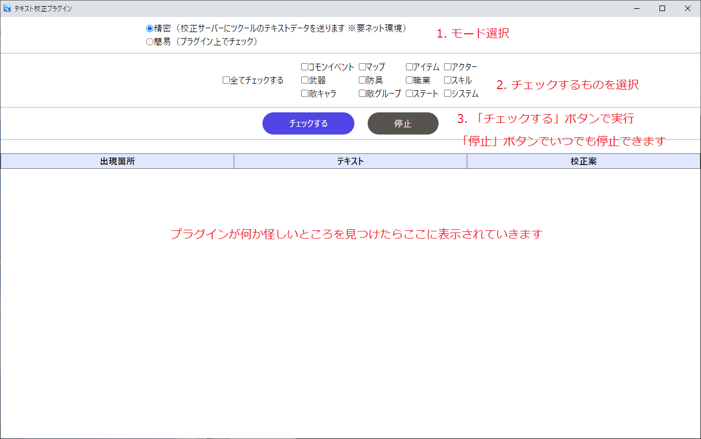

# RPGツクールMZ用テキスト校正プラグイン

## 使い方
1. [DRS_TextProofread.js](https://github.com/doujinreviewers/DRS_TextProofread/releases/download/v1.0.0/DRS_TextProofread.js)をダウンロード
2. DRS_TextProofread.jsを\[ツクールMZのプロジェクトフォルダ]\js\pluginsに配置
3. ツクールMZを起動してツール→プラグイン管理からDRS_TextProofreadを選択してONにする
4. ツクールMZのゲーム→テストプレイを実行し、ゲーム起動と同時に下記の画面が出ればOK

## モード
### 精密
こちらのサーバーにゲーム内のテキストデータを送信します。
機械学習のT5モデルを用いて校正したのち、textlintで静的チェックしています。

### 簡易
プラグインだけで校正を完結できます。
textlintで静的チェックするだけです。
検出できるのは不自然な助詞の連続、サ抜き言葉、サ入れ言葉、れ足す言葉などです。

## build
1. `npm install`
2. `npm run build-all`

## ライセンス
MIT